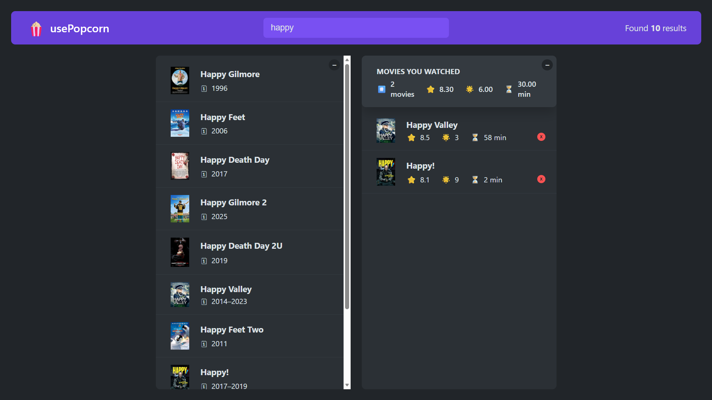

# 🎬 Movie Watchlist

A modern React application that allows users to search movies, explore detailed information, rate them, and manage a personal watchlist — powered by the OMDb API.

---

## 🔗 Live Demo

[](https://movie-watchlist-jet.vercel.app/)

---

## 📸 Screenshot



> 💡 Replace `screenshot.png` with your actual screenshot file or use an image URL.

---

## 🚀 Features

- 🔍 Search movies by title
- 🎥 View detailed movie information
- ⭐ Rate movies using a reusable star rating component
- ➕ Add and ❌ remove movies from a watched list
- 💾 Persist watched movies using localStorage
- ⌨️ Keyboard shortcuts:
  - `Enter` → focus search
  - `Escape` → close details
- ⚡ Loading and error handling for API requests

---

## 🛠 Tech Stack

- React
- JavaScript
- OMDb API
- Vite
- CSS

---

## 🧠 What I Learned

- Managing side effects with `useEffect`
- Importance of cleanup functions in React
- Preventing unnecessary API requests
- Building reusable components and custom hooks
- Persisting state using localStorage
- Handling async behavior and edge cases correctly

---

## ▶️ Run Locally

```bash
git clone https://github.com/thekaransaini/react-projects.git
cd movie-watchlist
npm install
npm run dev
```
