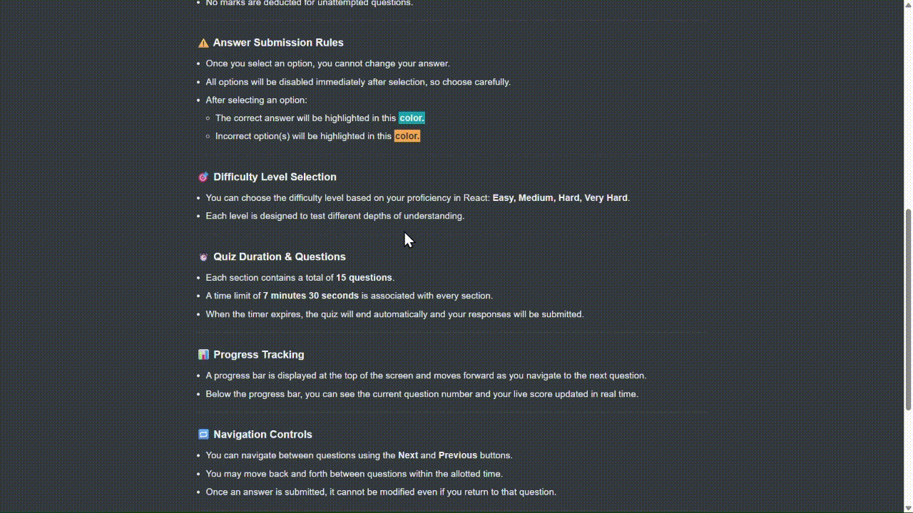

# 🧠 React Quiz App

An advanced, fully interactive React Quiz Application built using **React, useReducer, and custom hooks**.  
This project demonstrates complex state management, dynamic question fetching, negative marking logic, timer handling, and scalable project architecture.

---

## 🚀 Live Demo

- 🔗 Live Demo: [React Quiz App](https://react-projects-sigma-drab.vercel.app/)
- 🔗 API Server: [Render JSON Server](https://react-quiz-json-4sao.onrender.com)

---

## 🎥 Project Demo



---

## ✨ Features

### 🏁 Quiz Flow

- Start screen with general instructions
- Terms & Conditions checkbox before starting
- Difficulty selection (Easy, Medium, Hard, Very Hard)
- 15 questions per difficulty level
- Automatic quiz completion on timer expiry

---

### 📊 State Management

- Managed using **useReducer**
- Extracted quiz logic into a custom hook: `useQuiz`
- Centralized state includes:
  - questions
  - current index
  - answers
  - visited questions
  - score
  - high score
  - timer
  - quiz status (ready, active, finished, error)

---

### 🎯 Question Navigation

- Next & Previous buttons
- Question palette navigation
- Track visited questions
- Prevent re-answering
- Disable options after selection
- Highlight correct and incorrect answers

---

### 🧮 Marking Scheme

- Questions carry different points: **10, 20, 30, 50**
- ✅ Correct Answer → Full points awarded
- ❌ Incorrect Answer → 30% negative marking
- ⚪ Unattempted → No deduction
- Live score tracking
- High score maintained during session

---

### ⏱️ Timer

- 30 seconds per question
- Total duration: 7 minutes 30 seconds
- Auto-submit when time expires

---

### 📈 Progress Tracking

- Dynamic progress bar
- Current question indicator
- Real-time score display

---

### 🎨 UI/UX Enhancements

- Loader component
- Error handling component
- Question status legend
- Clean folder architecture
- Prevent predictable answer patterns

---

## 📌 General Instructions (Displayed in App)

### 🧭 Question Status Legend

- Not Visited
- Visited but Not Answered
- Answered

### 🧮 Negative Marking

- 30% deduction for incorrect answers
- No deduction for unattempted questions

### ⚠️ Answer Rules

- Once selected, answers cannot be changed
- Options are disabled immediately after selection
- Correct & incorrect answers are visually highlighted

### 🎯 Difficulty Levels

- Easy
- Medium
- Hard
- Very Hard

### 🔁 Navigation

- Move between questions using Next/Previous
- Navigate directly using question palette
- Cannot modify submitted answers

---

## 🗂️ Project Structure

```
src/
 ├── components/
 ├── hooks/
 │    └── useQuiz.jsx
 ├── App.jsx
 ├── main.jsx
 ├── index.css
```

---

## 🛠️ Tech Stack

- React
- useReducer
- useEffect
- Custom Hooks
- JSON Server
- Render (API Deployment)
- CSS

---

## ⚙️ Installation & Setup

### 1️⃣ Clone the repository

```bash
git clone https://github.com/your-username/react-quiz.git
cd react-quiz
```

### 2️⃣ Install dependencies

```bash
npm install
```

### 3️⃣ Run JSON Server locally (if needed)

```bash
json-server --watch data/questions.json --port 8000
```

### 4️⃣ Start development server

```bash
npm run dev
```

---

## 🌐 Deployment

- Frontend deployed on Vercel
- Backend JSON Server deployed on Render
- Uses dynamic PORT configuration for production

---

## 🧠 What I Practiced In This Project

- Advanced useReducer patterns
- Action-based state transitions
- Custom hook architecture
- Timer & side effect handling
- Negative marking algorithm
- State immutability best practices
- Scalable folder structuring
- Clean commit history using Conventional Commits

---

## 👨‍💻 Author

Karan Saini

---

⭐ If you found this project helpful, consider giving it a star!
