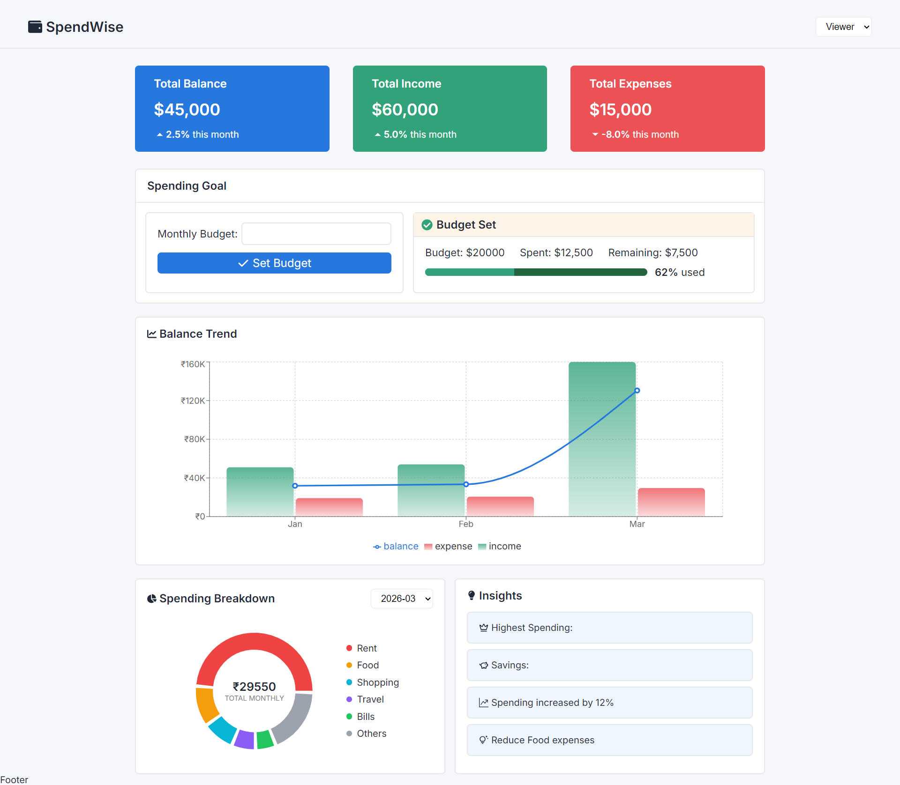

# 💸 SpendWise

A modern personal finance dashboard to track income, expenses, and overall financial health — built with a focus on clean UI, usability, and insightful data visualization.

> 🚧 **Project Status: Ongoing (Work in Progress)**  
> This project is currently under active development and is not yet complete. Features and UI are continuously being improved.

---

## 📸 Preview



---

## ✨ Features (Current & Planned)

### 1. 📊 Dashboard Overview

- Summary cards:
  - Total Balance
  - Total Income
  - Total Expenses
- Time-based visualization:
  - Balance trend chart
- Categorical visualization:
  - Spending breakdown (e.g., rent, food, shopping)

---

### 2. 💳 Transactions Section _(Planned)_

- Display list of transactions with:
  - Date
  - Amount
  - Category
  - Type (Income / Expense)
- Features:
  - Filtering
  - Sorting
  - Search functionality

---

### 3. 👤 Basic Role-Based UI _(Planned)_

- Simulated roles (frontend only):
  - **Viewer**
    - Can only view data
  - **Admin**
    - Can add/edit transactions
- Role switching:
  - Dropdown or toggle for demonstration

---

### 4. 📈 Insights Section

- Highlights:
  - Highest spending category
  - Monthly comparisons
  - Smart observations (e.g., spending trends)

---

### 5. 🧠 State Management _(Planned / In Progress)_

- Manage:
  - Transactions data
  - Filters
  - Selected role
- Possible approaches:
  - Context API
  - Or structured local state

---

### 6. 🎨 UI & UX Goals

- Clean and intuitive interface
- Responsive design (mobile + desktop)
- Graceful handling of empty states
- Smooth user experience

---

## 🚀 Advanced Features (Planned)

- 🌙 Dark Mode
- 💾 Data persistence (Local Storage)
- 🔌 Mock API integration
- ✨ Animations and transitions
- 📤 Export data (CSV / JSON)
- 🔍 Advanced filtering & grouping

---

## 🛠️ Tech Stack

- Frontend: HTML, CSS, JAVASCRIPT, React
- Styling: CSS
- Charts: Recharts

---

## ⚙️ Installation

```bash
# Clone the repository
git clone https://github.com/your-username/spendwise.git

# Navigate to project folder
cd spendwise

# Install dependencies
npm install

# Run development server
npm run dev
```

---

## 📌 Notes

- This project is being built as a learning and portfolio project.
- Features may change or expand over time.
- Feedback and suggestions are welcome!

---

## 🤝 Contributing

Currently not open for contributions, but feel free to fork or suggest improvements.

---

## 📜 License

No license added yet. This project is still under development.

---

## 🙌 Acknowledgements

- Inspiration from modern finance dashboards
- UI/UX patterns from popular fintech apps

---

⭐ If you like this project, consider giving it a star!
