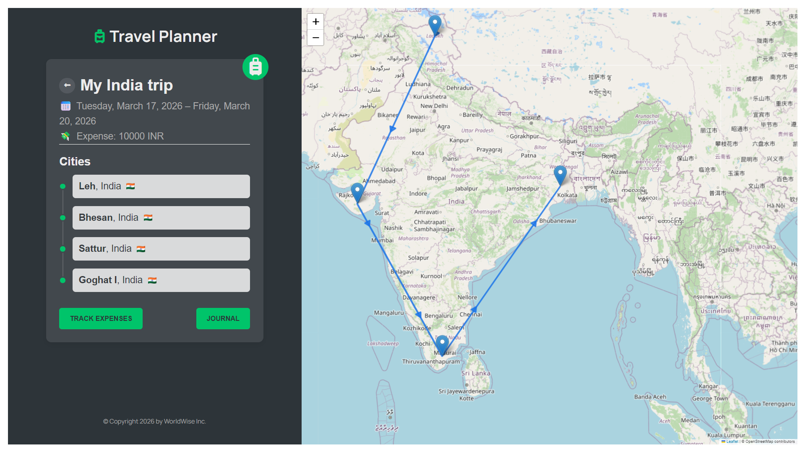

# 🌍 Travel Planner App

A modern **Travel Planner web application** built with React that helps users plan trips, manage destinations, and visualize their journey on an interactive map.

> 🚧 **Status: Ongoing Project** – New features like Journal, Expense Tracker, and Packing List are currently in development.

---

## ✨ Features

- 🧳 Create and manage trips
- 📍 Add multiple cities to a trip
- 🗺️ Interactive map visualization using Leaflet
- ➡️ Route display with polylines between cities
- 📅 Trip date management
- 🗑️ Delete trips along with associated cities
- ⚡ Centralized state management using Context API + useReducer
- 🔄 Real-time UI updates (without refresh)

---

## 📸 Preview



---

## 🛠️ Tech Stack

- **Frontend:** React, JavaScript, HTML, CSS
- **State Management:** Context API + useReducer
- **Routing:** React Router
- **Maps:** Leaflet + React-Leaflet
- **Backend (Mock API):** JSON Server

---

## 🧠 Key Learnings

- Managing complex state with **useReducer**
- Structuring scalable apps using **Context API**
- Handling async operations & API integration
- Working with map libraries and geolocation data
- Implementing clean component architecture

---

## 🚀 Upcoming Features

- 📝 Trip Journal
- 💸 Expense Tracker (per trip)
- 🎒 Packing List
- 📱 Responsive Design
- ✏️ Edit Trip & Cities (planned)

---

## 📂 Project Structure

```
src/
 ├── components/
 ├── pages/
 ├── context/
 ├── hooks/
```

---

## ⚙️ Installation & Setup

```bash
# Clone the repo
git clone https://github.com/your-username/travel-planner.git

# Go to project folder
cd travel-planner

# Install dependencies
npm install

# Start development server
npm run dev

# Run JSON server (mock backend)
npm run server
```

---

## 📌 Future Improvements

- Better error handling
- Optimized performance
- Improved UX/UI
- Backend integration (Node.js / Firebase)

---

## 🙌 Author

**Karan Saini**  
Frontend Developer (React)

---

## ⭐ Note

This project is actively being improved as part of my learning journey in frontend development.
